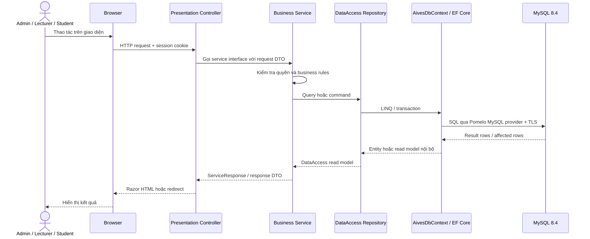

# AssignmentPRN system architecture

Sơ đồ phản ánh kiến trúc ba tầng hiện tại: `Presentation → Business → DataAccess`.

## Sơ đồ tổng quan ba tầng

Nét liền là request đi xuống, nét đứt là response đi lên. Business và DataAccess được build thành class library (`.dll`) và được Presentation tham chiếu.

## Sơ đồ chi tiết

Source Mermaid có thể chỉnh sửa tại [architecture.mmd](architecture.mmd). GitHub hiển thị trực tiếp SVG ở trên và vẫn cho phép xem source của sơ đồ.

## Luồng request đến database

## Cách kết nối MySQL

1. `Program.cs` đọc `ConnectionStrings:DefaultConnection` từ cấu hình ứng dụng hoặc biến môi trường.
2. `AddBusiness(...)` gọi `AddDataAccess(...)` trong lúc đăng ký dependency injection.
3. DataAccess gọi `UseMySql(connectionString, MySqlServerVersion(8.4.8))` để cấu hình `AivesDbContext`.
4. Repository nhận `AivesDbContext` theo request scope và dùng EF Core để sinh SQL.
5. `DatabaseInitializerHostedService` chạy lúc khởi động, gọi `CanConnectAsync` và đọc số lượng dữ liệu cơ bản. Nó không tự tạo schema hay seed dữ liệu.
6. Chuỗi kết nối mẫu dùng MySQL trên Aiven với `SslMode=Required`; mật khẩu thật không được commit vào Git.

## Luồng file tài liệu

`CourseMaterialsController → ICourseMaterialService → CourseMaterialService → LocalMaterialFileStore → wwwroot/materials`

Controller chỉ gọi service của Business. Business điều phối metadata và file; việc tạo đường dẫn, ghi, đọc và xóa file nằm trong DataAccess implementation.

## Quy tắc phụ thuộc

- Presentation chỉ tham chiếu Business; không truy cập DataAccess, Repository hay `AivesDbContext`.
- Business chứa service interface, request/response DTO, enum công khai và các quy tắc nghiệp vụ; Business gọi DataAccess.
- DataAccess chứa EF Core, entity, read model nội bộ, repository, MySQL provider và local file-store implementation.
- Chiều tham chiếu project là `Presentation → Business → DataAccess`; không có project `Domain` riêng.
