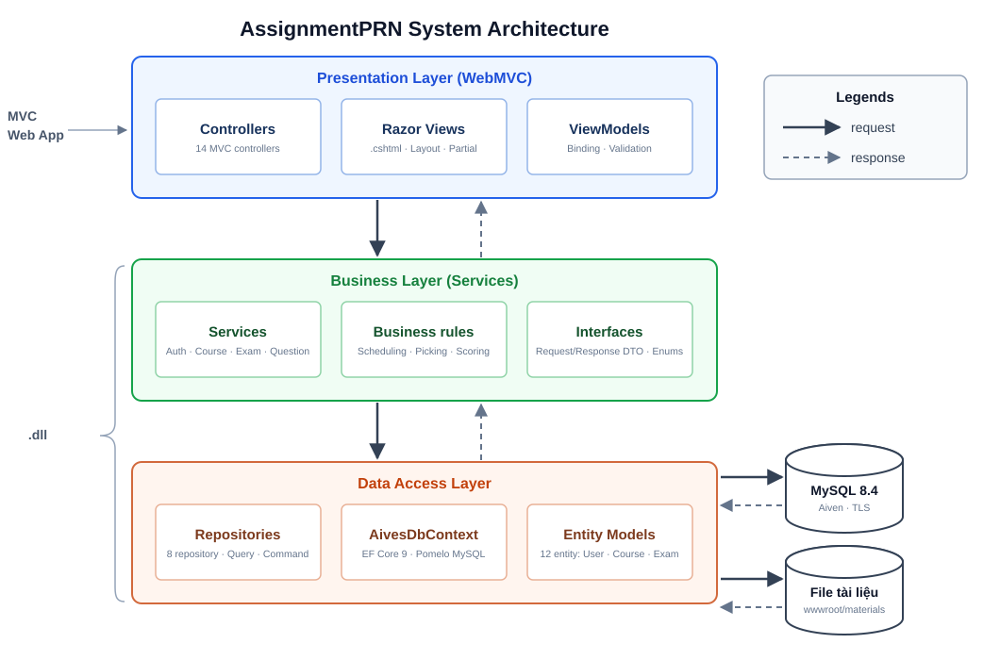
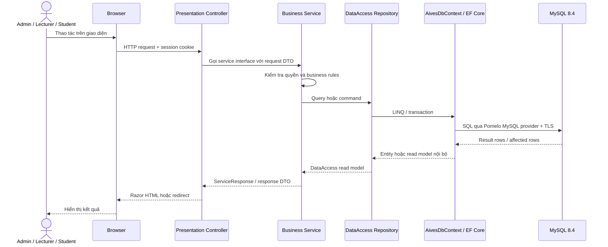

# AssignmentPRN system architecture

Sơ đồ phản ánh kiến trúc ba tầng hiện tại: `Presentation → Business → DataAccess`.

## Sơ đồ tổng quan ba tầng

Nét liền là request đi xuống, nét đứt là response đi lên. Business và DataAccess được build thành class library (`.dll`) và được Presentation tham chiếu.

## Sơ đồ chi tiết

Source Mermaid có thể chỉnh sửa tại [architecture.mmd](architecture.mmd). GitHub hiển thị trực tiếp SVG ở trên và vẫn cho phép xem source của sơ đồ.

## Luồng request đến database

## Cách kết nối MySQL

1. `Program.cs` đọc `ConnectionStrings:DefaultConnection` từ cấu hình ứng dụng hoặc biến môi trường.
2. `AddBusiness(...)` gọi `AddDataAccess(...)` trong lúc đăng ký dependency injection.
3. DataAccess gọi `UseMySql(connectionString, MySqlServerVersion(8.4.8))` để cấu hình `AivesDbContext`.
4. Repository nhận `AivesDbContext` theo request scope và dùng EF Core để sinh SQL.
5. `DatabaseInitializerHostedService` chạy lúc khởi động, gọi `CanConnectAsync` và đọc số lượng dữ liệu cơ bản. Nó không tự tạo schema hay seed dữ liệu.
6. Chuỗi kết nối mẫu dùng MySQL trên Aiven với `SslMode=Required`; mật khẩu thật không được commit vào Git.

## Luồng file tài liệu

`CourseMaterialsController → ICourseMaterialService → CourseMaterialService → LocalMaterialFileStore → src/AssignmentPRN.DataAccess/Storage/materials`

Thư mục lưu trữ nằm **ngoài `wwwroot`** là có chủ đích: mọi thứ dưới `wwwroot` đều được
`UseStaticFiles()` phục vụ thẳng, không qua controller, nên ai biết URL cũng tải được dù
chưa đăng nhập. Đặt ra ngoài thì mọi lượt tải đều phải đi qua `CourseMaterialsController.Download`,
nơi `[SessionAuthorize(Admin, Lecturer)]` kiểm tra phiên trước. Đường dẫn lấy từ cấu hình
`MaterialStorage:RootPath`; giá trị tương đối được tính theo content root, còn khi publish thì
đặt đường dẫn tuyệt đối vì thư mục project chỉ tồn tại trong bản checkout.

Controller chỉ gọi service của Business. Business điều phối metadata và file; việc tạo đường dẫn, ghi, đọc và xóa file nằm trong DataAccess implementation.

## Quy tắc phụ thuộc

- Presentation chỉ tham chiếu Business; không truy cập DataAccess, Repository hay `AivesDbContext`.
- Business chứa service interface, request/response DTO, enum công khai và các quy tắc nghiệp vụ; Business gọi DataAccess.
- Quy tắc nghiệp vụ nằm **trong chính service sở hữu nó**, dưới dạng thành viên `internal static` nhận mọi đầu vào qua tham số: `QuestionService` giữ việc phát đề, vòng đào sâu, đọc file nhập và kiểm tra lưu tạm; `ExamSessionService` giữ việc sinh ca thi và kiểm tra ngân hàng đủ câu; `ExamResultService` giữ việc chốt ca quá giờ; cách chấm điểm nằm cạnh DTO công bố `Score` trong `Interfaces/Contracts.cs`.
- `Policies/` chỉ chứa phần mà service **không** giữ được: `ExamSessionRules`, `ExamLifecycleRules` và `ExamStatePolicy`. Repository cần các quyết định này ngay bên trong transaction, mà DataAccess không gọi được service — tham chiếu project sẽ thành vòng tròn. DataAccess khai `IExamStatePolicy` trong `Contracts/`, Business cắm `ExamStatePolicy` vào qua DI.
- DataAccess chứa EF Core, entity, read model nội bộ, repository, MySQL provider và local file-store implementation.
- Chiều tham chiếu project là `Presentation → Business → DataAccess`; không có project `Domain` riêng.

## Cấu trúc thư mục theo sơ đồ

Mỗi hộp trong sơ đồ tương ứng một thư mục thật; thêm file mới phải đặt đúng thư mục của hộp đó.

| Tầng | Hộp trong sơ đồ | Thư mục | Namespace |
|---|---|---|---|
| Presentation | Controllers | `Controllers/` | `AssignmentPRN.Presentation.Controllers` |
| Presentation | Razor Views | `Views/` | *(không tự khai báo — xem ghi chú dưới bảng)* |
| Presentation | ViewModels | `ViewModels/` | `AssignmentPRN.Presentation.ViewModels` |
| Business | Services | `Services/` | `AssignmentPRN.Business.Services` |
| Business | Services (dòng "3 policy") | `Policies/` | `AssignmentPRN.Business.Policies` |
| Business | Interfaces | `Interfaces/` | `AssignmentPRN.Business.Interfaces` |
| DataAccess | Repositories | `Repositories/` | `AssignmentPRN.DataAccess.Repositories` |
| DataAccess | AivesDbContext | `Data/` | `AssignmentPRN.DataAccess.Data` |
| DataAccess | Entity Models | `Entities/` | `AssignmentPRN.DataAccess.Entities` |

File `.cshtml` không khai báo namespace như file `.cs`. Lúc build, Razor sinh ra một lớp
cho mỗi view và đặt tất cả vào namespace `AspNetCoreGeneratedDocument`, tên lớp ghép từ
đường dẫn — `Views/Account/Login.cshtml` thành `AspNetCoreGeneratedDocument.Views_Account_Login`.
Có thể đổi bằng chỉ thị `@namespace`, nhưng dự án không dùng. Các `@using` dùng chung cho
mọi view khai báo một lần ở `Views/_ViewImports.cshtml`.

Sơ đồ tổng quan chỉ vẽ phần nghiệp vụ, kèm số lượng từng hộp. Phần hạ tầng không vẽ vì
nó giống nhau ở mọi project ASP.NET Core và không nói lên kiến trúc của dự án này; bảng
dưới liệt kê đầy đủ để không thiếu thứ gì khi tìm file:

| Tầng | Hạ tầng (không vẽ) | Vai trò |
|---|---|---|
| Presentation | `Program.cs` | Đăng ký DI, cấu hình middleware |
| Presentation | `appsettings.json` | `ConnectionStrings:DefaultConnection`, `MaterialStorage:RootPath` |
| Presentation | `Constants/`, `Filters/`, `Properties/`, `Styles/`, `wwwroot/` | Hằng số, `SessionAuthorizeAttribute`, cấu hình chạy, SCSS, tài nguyên tĩnh |
| Business | `ServiceCollectionExtensions.cs` | `AddBusiness()` — đăng ký DI, gọi tiếp `AddDataAccess()` |
| Business | `DataAccessMappings.cs` | Chuyển enum/DTO giữa Business và DataAccess |
| DataAccess | `Contracts/` | Read model nội bộ, input ghi, `IExamStatePolicy` |
| DataAccess | `Enums/`, `Extensions/` | Enum khớp cột MySQL; `AddDataAccess()` |
| DataAccess | `Services/` | `LocalMaterialFileStore` (lưu file) và `DatabaseInitializer` (kiểm tra kết nối lúc khởi động) |
| DataAccess | `Common/` | `ExamScheduleConflictException` |

Riêng `Storage/materials` có vẽ, thành hình trụ "File tài liệu", vì nó là nơi dữ liệu nằm
chứ không phải hạ tầng. Project `tests/AssignmentPRN.Tests` cố ý không vẽ vì không chạy
lúc runtime.
