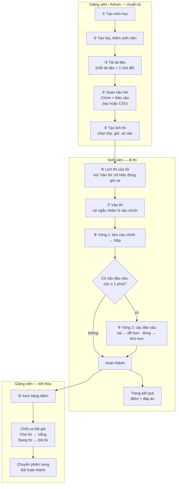
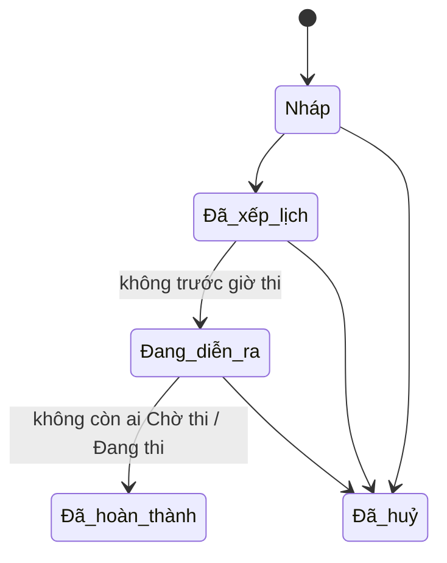

# AIVES — Luồng hệ thống và kiểm thử Chức năng 2

Ngày kiểm thử: 29/09/2026 · Nhánh: `TriMinhDev` · Kiểm thử bằng cách chạy thật trên web với dữ liệu thử `TFLOW`.

Tài liệu gồm 3 phần:

1. [Hệ thống hoạt động thế nào](#phần-1--hệ-thống-hoạt-động-thế-nào) — ai làm gì, theo thứ tự nào.
2. [Các thay đổi của Chức năng 2](#phần-2--các-thay-đổi-của-chức-năng-2) — vấn đề, cách sửa, kết quả kiểm tra lại.
3. [Dữ liệu thử và cách chạy lại](#phần-3--dữ-liệu-thử-và-cách-chạy-lại).

---

## Phần 1 — Hệ thống hoạt động thế nào

### 1.1. Ba vai trò

| Vai trò | Làm được gì | Trang chính |
|---|---|---|
| **Admin** | Mọi việc của giảng viên, trên **tất cả** môn. | `/Admin` |
| **Giảng viên** | Môn học, lớp học, tài liệu, ngân hàng câu hỏi, lịch thi, kết quả — chỉ trên môn **mình phụ trách**. | `/Lecturer` |
| **Sinh viên** | Xem lịch thi của mình, vào thi, xem kết quả bài vừa nộp. | `/Student` |

Sinh viên tự đăng ký được tài khoản. Admin và giảng viên phải có sẵn trong database.

### 1.2. Cách code được chia tầng

```
Trình duyệt ──► Controller (Presentation) ──► Service (Business) ──► Repository (DataAccess) ──► MySQL
                chỉ điều hướng,                luật nghiệp vụ,          đọc/ghi bằng EF Core
                kiểm tra form                  kiểm tra quyền
```

Đăng nhập lưu `UserId` và `Role` vào **Session** (không dùng cookie xác thực của ASP.NET). Mỗi controller gắn `[SessionAuthorize(...)]` để chặn sai vai trò.

### 1.3. Toàn bộ luồng, từ chuẩn bị tới kết quả



### 1.4. Chi tiết từng bước

**① Môn học** — `/Courses`
- Mã môn tự viết hoa, không được trùng.
- Môn đã có lớp hoặc phiên thi thì không xoá được, chỉ **Ngừng hoạt động**.

**② Lớp học** — `/Classes`
- Mỗi lớp thuộc đúng 1 môn và 1 giảng viên (phải là giảng viên phụ trách môn đó).
- Danh sách sinh viên của lớp là nguồn để tạo lịch thi.

**③ Tài liệu** — `/CourseMaterials`
- Chỉ nhận PDF, DOCX, PPTX, tối đa 20 MB.
- Mỗi tài liệu đóng vai trò **một chủ đề**; câu hỏi được gắn vào chủ đề.

**④ Ngân hàng câu hỏi** — `/Questions`
- Mỗi câu có 2–8 phương án, đúng **một** phương án đúng.
- Hai loại: **Chính** (phát ở vòng 1) và **Đào sâu** (phát ở vòng 2, bắt buộc có chủ đề).
- Câu tạo ra được duyệt ngay. Muốn ngừng dùng thì **Ẩn** (Archive), không xoá.

**⑤ Tạo lịch thi** — `/ExamSessions/Create`
- Chọn môn, lớp, giờ bắt đầu, số phút mỗi sinh viên, số câu chính, số câu đào sâu tối đa.
- Hệ thống xếp **mỗi sinh viên một ca nối tiếp nhau** (08:00, 08:15, 08:30…).
- Kiểm tra: không đặt trong quá khứ, xong trong ngày, không trùng lịch của sinh viên hay giảng viên, và ngân hàng đủ **số sinh viên × số câu chính** câu khác nhau.
- **Chưa rút đề ở bước này.**

**⑥–⑨ Sinh viên đi thi** — `/StudentSchedule/Mine` → `/ExamRoom`
- Nút **Vào thi** chỉ hiện trong đúng khung giờ của ca.
- Bấm vào thì hệ thống rút ngẫu nhiên N câu chính, không trùng với sinh viên khác cùng phiên.
- Đồng hồ đếm ngược do server tính. Về 00:00 thì tự nộp; được nộp trễ tối đa 2 phút.
- Nộp vòng 1 → server chấm ngay → chọn câu đào sâu theo luật:
  - câu **sai** → hỏi câu **dễ hơn hoặc bằng**, cùng chủ đề;
  - câu **đúng** → hỏi câu **khó hơn hoặc bằng**, cùng chủ đề;
  - ưu tiên câu sai trước, tối đa bằng "số câu đào sâu" của phiên.
- Nộp vòng 2 → hoàn thành → xem điểm và đáp án.

**⑩ Kết quả** — `/ExamResults/Index/{id}`
- Bảng điểm từng sinh viên; mở từng bài làm để xem đáp án đã chọn.
- **Chốt ca**: ca đã hết mà sinh viên chưa vào → **Vắng**; đang làm mà bỏ ngang → **Đã thi**, chấm trên phần đã lưu.
- Sau khi chốt, chuyển phiên sang **Đã hoàn thành**.

### 1.5. Cách tính điểm

- Câu chính trọng số **1**, câu đào sâu trọng số **0,5**.
- Điểm = (tổng trọng số câu đúng ÷ tổng trọng số) × 10, làm tròn 1 chữ số.
- Ví dụ: đúng 3/3 câu chính, đúng 1/2 câu đào sâu → (3 + 0,5) ÷ 4 × 10 = 8,75 → **8,8**.

### 1.6. Trạng thái

**Phiên thi:**



Phiên mới tạo ở **Đã xếp lịch**. Sinh viên thi được khi phiên ở **Đã xếp lịch** hoặc **Đang diễn ra**. Mọi chuyển trạng thái đều do giảng viên bấm tay.

**Lượt thi của từng sinh viên:** Chờ thi → Đang thi → Đã thi, hoặc Chờ thi → Vắng (khi chốt ca).

---


## Phần 2 — Các thay đổi của Chức năng 2

Nhóm phụ trách **Chức năng 2 — Quản lý kỳ thi & lịch thi**. Đợt này siết lại các luật của luồng lịch thi để giữ đúng hai cam kết của đề bài: *không trùng câu giữa các thí sinh* và *cấu hình được số câu cho mỗi thí sinh*.

| # | Trước đây | Cách sửa | Kết quả kiểm tra lại |
|---|---|---|---|
| 1 | Tạo được phiên cần nhiều câu hơn ngân hàng đang có; sinh viên chỉ bị báo lỗi lúc vào thi | Phiên cần **số SV × số câu chính** câu khác nhau (`QuestionSupplyRules`). Thiếu thì chặn khi tạo phiên, khi sửa số câu hoặc đổi môn, khi thêm sinh viên | Phiên cần 30 câu (có 12) bị chặn; sửa lên 15 câu, thêm SV thành 18 câu đều bị chặn; vừa đủ 12 câu thì tạo được |
| 2 | Bấm đúp "Vào thi", hoặc giảng viên phát đề đúng lúc sinh viên vào, có thể phát trùng hoặc phát hai lần | Mọi lần phát đề của một phiên chạy trong transaction và **khoá dòng phiên thi** (`QuestionRepository.DealAsync`); lần sau chờ lần trước ghi xong rồi mới đọc | 3 lần bấm "Vào thi" cùng lúc → đúng 3 dòng đề; 9 câu của 3 SV khác nhau hoàn toàn |
| 3 | Giảng viên huỷ được đề của sinh viên đang làm bài | "Đã bắt đầu" tính theo trạng thái sinh viên (đã vào thi / đang thi / đã thi); nút **Huỷ đề** ẩn theo cùng luật | Bị chặn: "Đã có sinh viên vào thi…"; nút Huỷ đề không còn hiện |
| 4 | Huỷ phiên không cập nhật sinh viên; sinh viên đang làm vẫn nộp tiếp được | Chặn huỷ khi còn SV **Đang thi**; huỷ được thì lượt **Chờ thi → Đã huỷ**, bài đã nộp và lượt vắng giữ nguyên (`ExamSessionRules`) | Bị chặn khi SV1 đang thi; SV1 nộp xong thì huỷ được, SV2/SV3 thành "Đã huỷ" và không vào thi được nữa |
| 5 | Đổi giờ một ca về quá khứ vẫn được | Chặn ở tầng Business, giống khi tạo phiên | "Giờ bắt đầu mới không được nằm trong quá khứ." |
| 6 | Thêm được sinh viên không học môn đó, hoặc đã có trong phiên | SV phải thuộc ít nhất một lớp đang hoạt động của môn và chưa có trong phiên | "… không thuộc lớp nào của môn TFLOW101."; "Sinh viên đã có trong phiên thi này." |
| 7 | Giảng viên chạm vào lớp/phiên của người khác làm trang sập (lỗi 500) | Bỏ `Forbid()` (app đăng nhập bằng Session, không có authentication scheme); quay về **Lịch thi** kèm thông báo đỏ; API danh sách lớp trả 403 kèm thông báo và trang Tạo lịch thi hiện đúng câu đó | Không còn lỗi 500; thông báo dùng component `app-alert` chung của hệ thống |

**Kiểm thử**

- Unit test: **82/82 pass**, trong đó có 12 test mới cho luật đủ câu và luật huỷ phiên.
- End-to-end trên web: toàn bộ kịch bản ở bảng trên, cộng kiểm tra hồi quy (đổi tên phiên, đổi giờ hợp lệ, thêm/xoá sinh viên, sinh viên làm bài 2 vòng, giảng viên xem lớp của mình) — đều chạy đúng; log server không có lỗi.

---

## Phần 3 — Dữ liệu thử và cách chạy lại

1. Nạp lại dữ liệu thử (xoá sạch dữ liệu `TFLOW` cũ và tạo mới, không đụng dữ liệu thật):

   ```bash
   mysql -h <host> -P <port> -u <user> -p <ten_db> < database/seed_test_flow.sql
   ```

2. Tài khoản thử (mật khẩu ghi ở đầu file SQL):

   | Email | Vai trò |
   |---|---|
   | `tflow.gv1@test.local` | Giảng viên A — môn TFLOW101 |
   | `tflow.gv2@test.local` | Giảng viên B — môn TFLOW202 (thử phân quyền) |
   | `tflow.sv1` … `sv3@test.local` | Sinh viên lớp TFLOW101-A |
   | `tflow.sv4@test.local` | Sinh viên lớp TFLOW202-A |

3. Các phiên thi có sẵn:

   | Phiên | Dùng để thử |
   |---|---|
   | [TFLOW-1] Thi ngay | Ca SV1 mở ngay sau khi chạy script, còn khoảng 14 phút |
   | [TFLOW-2] Đã thi hôm qua | Bảng điểm, bài làm, chốt ca (SV1 đã thi, SV2 bỏ ngang, SV3 vắng) |
   | [TFLOW-3] Tuần sau | Sửa phiên, đổi giờ, thêm/xoá sinh viên |
   | [TFLOW-4] Phiên của GV B | Giảng viên A mở phải bị chặn |

4. Giờ trong script tính theo giờ Việt Nam (UTC+7) cho khớp với app.

> Lưu ý: script không xoá được các tệp PDF đã upload trong lúc test; chúng nằm trong `src/AssignmentPRN.Presentation/wwwroot/materials/` (thư mục này bị Git bỏ qua).
