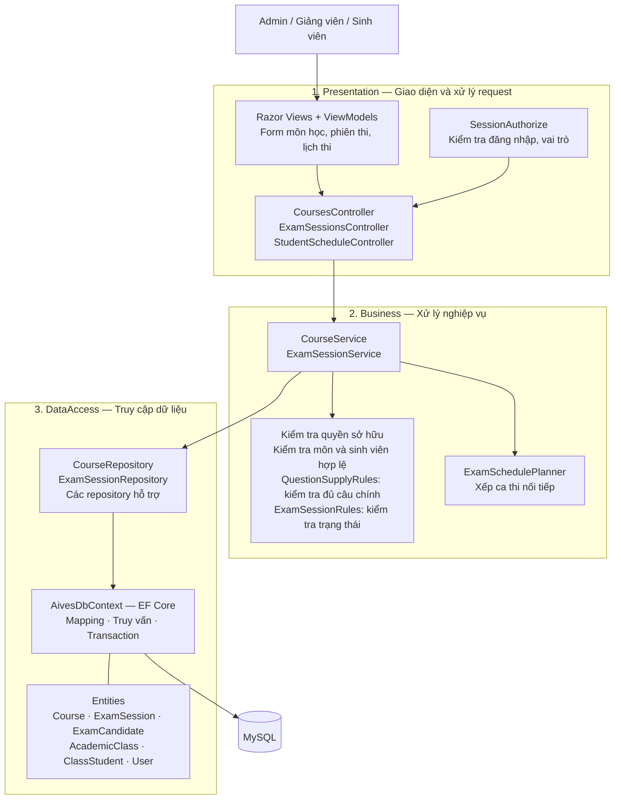

# Kiến trúc 3 tầng — Môn học và phiên thi

Phạm vi: quản lý môn học, phiên thi và lịch thi trong AIVES.

## Sơ đồ kiến trúc



Mũi tên thể hiện luồng xử lý chính. Controller gọi service; service gọi repository; repository truy cập MySQL thông qua EF Core. SessionAuthorize là filter chạy trước action để kiểm tra đăng nhập và vai trò.

## Chức năng phụ trách

| Chức năng | Xử lý chính |
|---|---|
| Quản lý môn học | Thêm, sửa, xóa môn; chuẩn hóa và kiểm tra trùng mã; ngừng hoạt động môn đã được sử dụng. |
| Tạo phiên thi | Chọn môn, giảng viên, lớp, thời gian, số câu chính và số câu đào sâu tối đa. |
| Xếp lịch thi | Xếp mỗi sinh viên một ca nối tiếp; kiểm tra trùng lịch sinh viên và giảng viên. |
| Sửa phiên, đổi giờ ca | Kiểm tra thời gian hợp lệ; xếp lại ca khi thay đổi giờ hoặc thời lượng phiên. |
| Quản lý thí sinh | Thêm, xóa sinh viên theo điều kiện; kiểm tra thuộc lớp của môn và đủ câu chính. |
| Quản lý trạng thái | Kiểm soát bắt đầu, hoàn thành, hủy phiên theo trạng thái và tiến độ thí sinh. |
| Lịch thi sinh viên | Hiển thị lịch cá nhân, thời gian ca và điều kiện vào thi. |

## Ví dụ luồng tạo phiên thi

```mermaid
sequenceDiagram
    actor U as Admin / Giảng viên
    participant C as ExamSessionsController
    participant S as ExamSessionService
    participant R as ExamSessionRepository
    participant DB as MySQL qua EF Core

    U->>C: Gửi form tạo phiên thi (POST)
    Note over C: Kiểm tra Session, vai trò,<br/>anti-forgery token và ModelState
    C->>S: Gọi CreateAsync với dữ liệu và người thao tác
    Note over S: Kiểm tra quyền, môn, lớp,<br/>thời gian và đủ câu chính;<br/>xếp các ca thi nối tiếp
    S->>R: Gửi dữ liệu phiên và danh sách lượt thi
    R->>DB: Kiểm tra xung đột lịch và lưu trong transaction
    DB-->>R: Kết quả lưu
    R-->>S: Chi tiết phiên thi
    S-->>C: Kết quả nghiệp vụ
    C-->>U: Chuyển đến chi tiết hoặc hiển thị lỗi
```

## Các luật nghiệp vụ quan trọng

- Admin quản lý toàn bộ; giảng viên chỉ quản lý môn hoặc phiên thuộc quyền phụ trách.
- Mã môn được trim, chuyển thành chữ hoa và kiểm tra trùng.
- Môn có dữ liệu liên quan không được xóa; có thể ngừng hoạt động.
- Ngày bắt đầu không trong quá khứ; thời lượng mỗi sinh viên từ 1 đến 1440 phút; toàn bộ ca phải kết thúc trong cùng ngày.
- Số câu chính cần có = số sinh viên × số câu chính mỗi sinh viên, vì câu chính không trùng giữa các sinh viên trong cùng phiên.
- Sinh viên thêm vào phải thuộc ít nhất một lớp đang hoạt động của môn và chưa có trong phiên.
- Chỉ sửa hoặc xóa phiên Nháp / Đã xếp lịch khi tất cả sinh viên còn Chờ thi; một số thao tác danh sách thí sinh có thêm điều kiện trước giờ bắt đầu.
- Không bắt đầu phiên trước giờ thi; chỉ hoàn thành khi không còn sinh viên Chờ thi hoặc Đang thi.
- Không hủy phiên khi còn sinh viên Đang thi. Khi hủy được, lượt Chờ thi chuyển thành Đã hủy; bài đã nộp và lượt vắng giữ nguyên.

## Cách trình bày với giảng viên

> Phần của em chia thành ba tầng. Presentation nhận thao tác từ giao diện và gọi service. Business kiểm tra quyền và các luật như thời gian hợp lệ, đủ câu hỏi, chuyển trạng thái và xếp lịch. DataAccess dùng repository và EF Core để đọc ghi MySQL. Ví dụ khi tạo phiên thi, request đi từ ExamSessionsController đến ExamSessionService, sau đó ExamSessionRepository lưu phiên và các lượt thi vào database.

MVC tổ chức phần web thành Model, View và Controller; kiến trúc ba tầng phân chia trách nhiệm toàn hệ thống. Dự án kết hợp cả hai. Business tham chiếu DataAccess, nên sơ đồ mô tả kiến trúc ba tầng hiện tại.

Phát đề, phòng thi, chọn câu đào sâu và chấm điểm thuộc các module phối hợp. Môn học và phiên thi cấu hình số câu và kiểm tra nguồn câu chính khi quản lý phiên thi.
